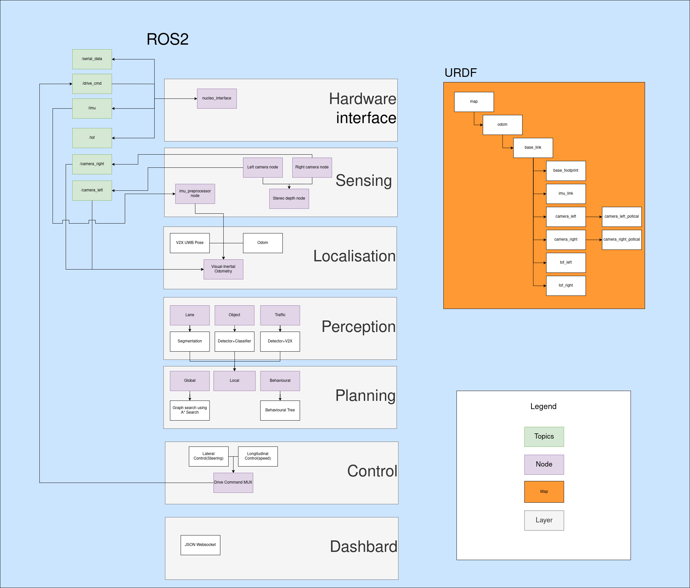

# Mach::Core

This repository is the central software stack for MACH::GO autonomous vehicle, developed for the [Bosch Future Mobility Challenge (BFMC)](https://boschfuturemobility.com/).

## System Architecture

## Documentation

Please refer to [ROS_Documentation.md](docs/ROS_Documentation.md) for information on packages, nodes and topics.

## Contributing

Please read the [CONTRIBUTING.md](CONTRIBUTING.md) file before making changes.
